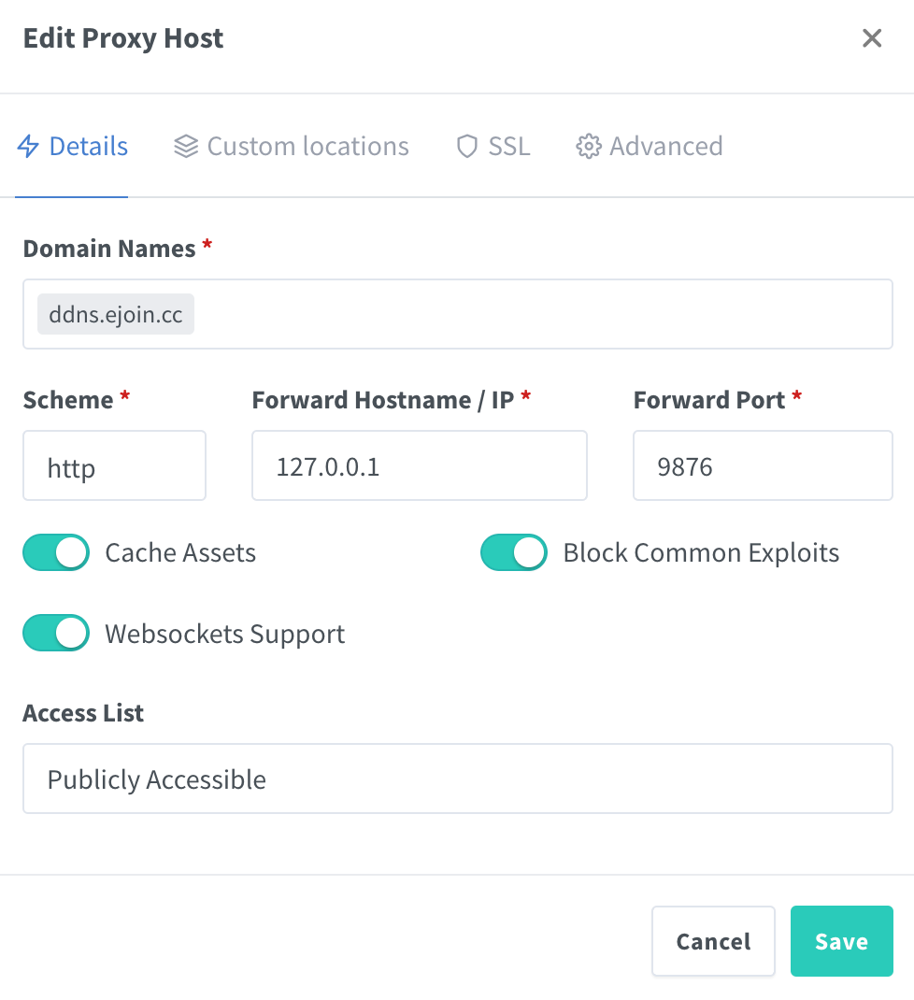
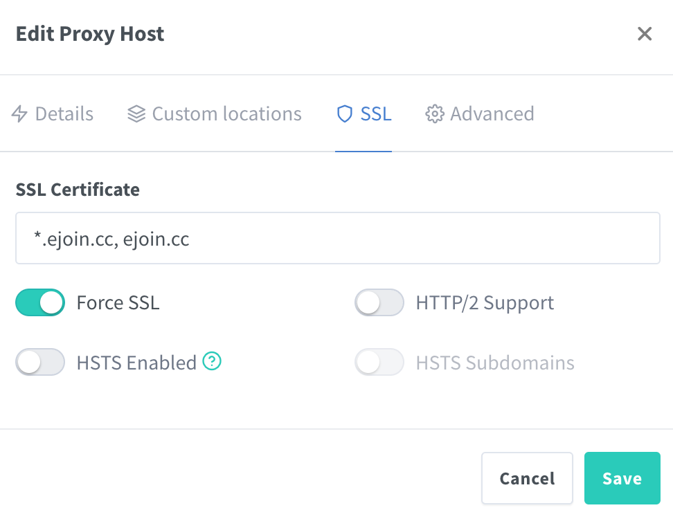

# Nginx

## 前言

配置了域名 DNS 后，我们可以使用域名访问到我们的服务器上。一般情况下，我们的服务器都部署了多个服务，我们希望使用不同的二级域名访问不同的服务。但 DNS 解析默认访问的端口是 80/443，而多个服务如果使用同一个端口会冲突，此时我们可以使用反向代理。

我们首先将不同的服务部署在不同的端口上，通过反向代理将不同的二级域名转发到不同的端口上，就可以满足我们的要求。

Cloudflare Tunnel 支持这种配置，但一般的请求会被解析到 Cloudflare 再通过 Tunnel 转发，可能影响访问速度。所以这里使用本地部署 Nginx 来进行 HTTP/HTTPS 的反向代理。

Nginx 是一种反向代理应用，也支持这样的配置方式，它可以完成各种复杂的操作。我们在服务器上使用 [Nginx Proxy Manager](https://nginxproxymanager.com/)（下面简称 NPM）来简化 Nginx 的安装配置流程，它还可以自动申请 SSL 证书，十分简便。

## 部署 NPM

在目录下创建编辑 docker-compose.yml 文件：

```yml
services:
  nginx:
    image: 'jc21/nginx-proxy-manager:latest'
    container_name: nginx
    restart: unless-stopped
    ports:
      - 80:80
      - 81:81
      - 443:443
    volumes:
      - ./data:/data
      - ./letsencrypt:/etc/letsencrypt
    network_mode: host
```

同样为了方便，直接使用 host 模式，ports 无意义，仅标记 NPM 使用的接口，NPM 使用 81 作为管理页面的端口，80 和 443 用于代理 HTTP/HTTPS 流量。

执行 docker-compose up -d 启动服务，执行完成后，在内网浏览器打开 `http://[内网 IP]:81`，开始进行配置。

## 配置 NPM

进入配置页面后先使用默认的 Email: `admin@example.com` 和 Password: `changeme` 进行登录。登录完毕后修改账号和密码。

下面我们配置 DDNS 和 NPM 的管理页面使其可以通过 HTTPS 域名进行访问。

首先我们来创建 SSL 证书。点击最上方的「SSL Certificates」，右侧「Add SSL Certificate」，可以使用「Let's Encrypt」提供的功能。

<div align=center>

</div>

「Domain Names」中可以配置多个域名，也可以使用通配符。和 DDNS 类似，需要在 Cloudflare 中创建 [API 令牌](https://dash.cloudflare.com/profile/api-tokens)，填写到等于号的后面。稍等片刻可以看到创建成功。

然后点击 Proxy Hosts，右上角新建一个新的配置，填写本地地址和 DDNS 管理页面的端口。

<div align=center>

</div>

在「SSL」中选择刚刚申请的通配 SSL 证书，打开强制 SSL 的开关。

<div align=center>

</div>

保存后可以看到这条反向代理配置，可以通过域名访问到 DDNS 管理页面进行配置。如果此时访问不到可以检查防火墙配置是否放行了 80/443 端口。

NPM 配置页面的反向代理配置类似，只需要把页面中转发到的端口改为 81 端口，设置想要的二级域名即可。